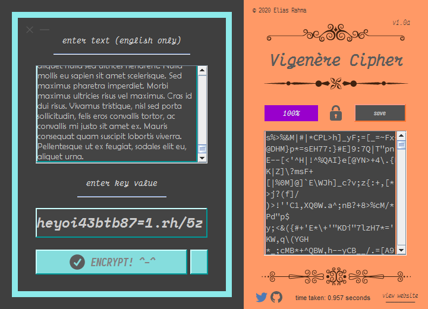
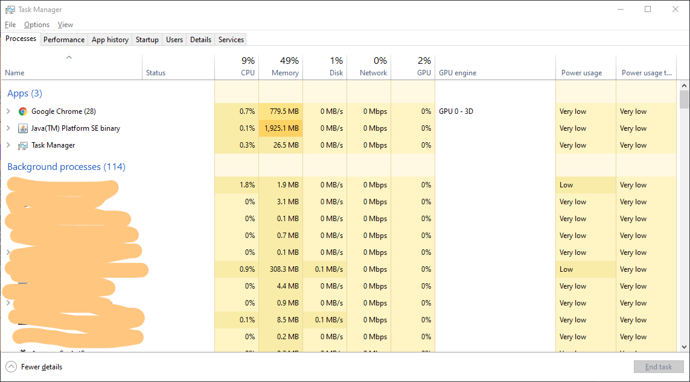

## Welcome!

Firstly, I would like to mention once more that this application was built for **entertainment purposes** only. Use it at your own risk!

Anyway, with this application, you can encrypt & decrypt text quickly no matter how long the length of the text is. (well idek how long is the maximum length tbh but I'm sure it's pretty high lol, I have tested it on old CPUs as well as new).

The application eats up *alot* of memory when **ALOT** of text is entered (idrk if this is normal or not but I dont think it is haha). I would recommend having _8 GB_ of memory installed.

### How I tested my application (not that it matters)
I was able to encrypt _9000_ paragraphs, _826,320_ words, & _5.57_ MB worth of Lorem Ipsum text in just _0.957_ seconds; however, the memory usage is **very high** consuming between _1,500_ & _3,500_ MB (programmers out there, help please! I would like to learn why this happens and whether it is normal or not)

