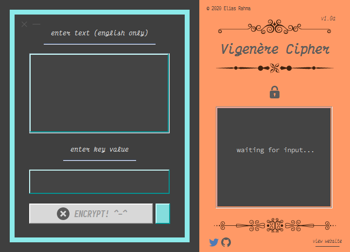

<figcaption>preview of the application</figcaption>

## Welcome!

Firstly, I would like to mention once again that this application was built for **entertainment purposes** only. Use it at your own risk!

Anyway, with this application, you can encrypt & decrypt text quickly no matter how long the length of the text is. (well idek how long is the maximum length tbh but I'm sure it's pretty high lol).

The application eats up *ALOT* of memory when *too much* text is entered (idrk if this is normal or not but I dont think it is haha). I would recommend having _8_ GB of memory installed.

### How I tested my application (not that it matters)
I was able to encrypt _9000_ paragraphs, _826,320_ words, & _5.57_ MB worth of Lorem Ipsum text in just _0.957_ seconds; however, the memory usage is **very high**, consuming between _1,500_ & _3,500_ MB (programmers out there, help please! I would like to learn why this happens and whether it is normal or not)

Have fun hehe!! Thank you!    
_If you'd like to donate, [click here](https://paypal.me/teryakiisauce) (PayPal)_

